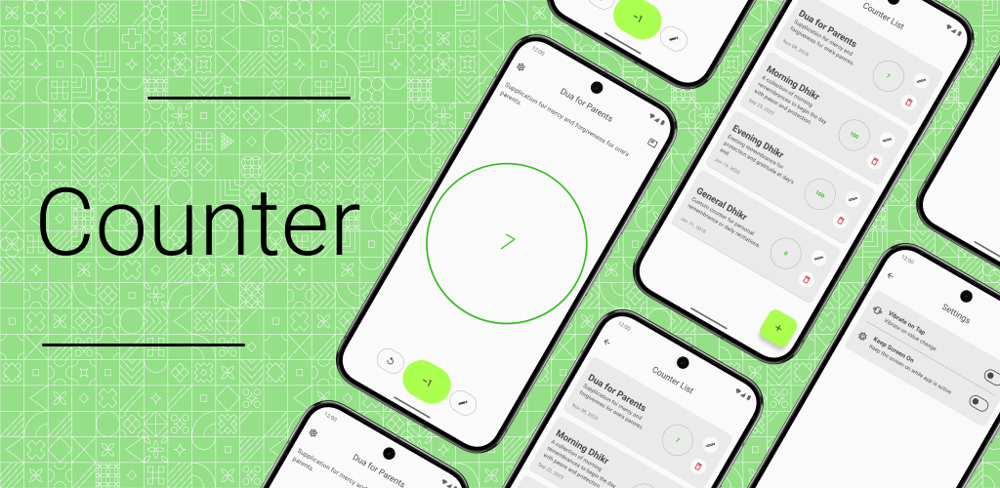
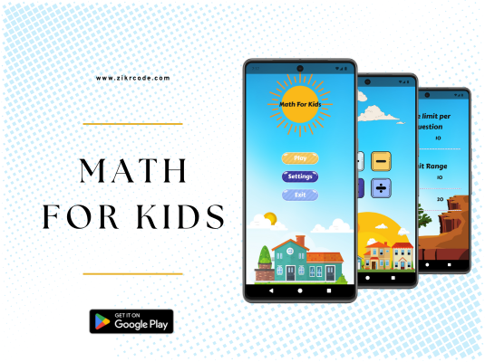
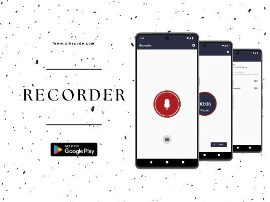
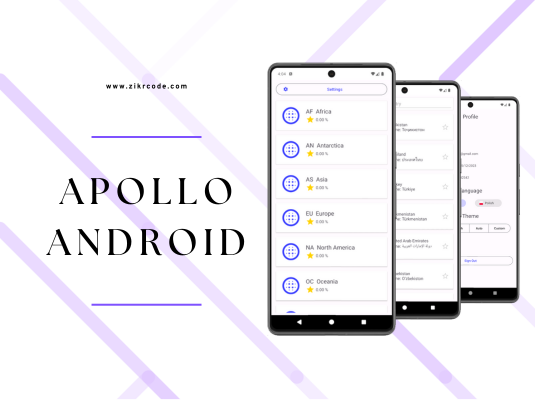
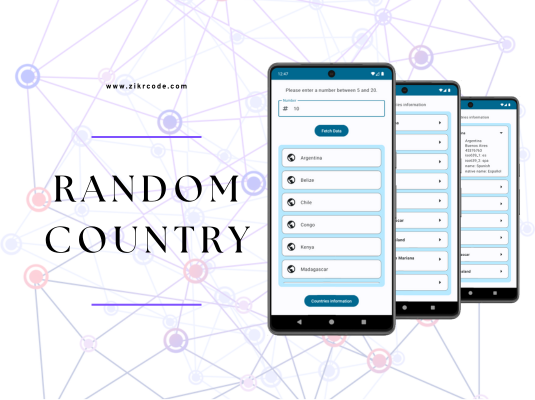

<picture></picture>

## Hi 👋, I'm Zokirjon — Mobile Developer (iOS · Android · Kotlin Multiplatform)

### 🚀 Featured Projects

|     |    |
| :-: | :- |
| <picture></picture>  | Translate text instantly with your device, directly from your screen! - **Screen Translate:** Floating button appears over any app. Tap it to capture a screenshot and instantly translate the text. - **Extract Text:** Upload or take a photo, extract text, and translate quickly and accurately.  Perfect for reading, learning, or understanding content in any language—all on your device.  **Tech Stack:** Kotlin · Jetpack Compose · Material 3 · Navigation Compose · Hilt (DI) · DataStore · ML Kit · Firebase Analytics · Firebase Crashlytics |
| <picture></picture>   | Counter — your go-to app for a seamless counting experience! - Three screens: Home, List, and Settings — designed for all your counting needs. - Manage counters on the Home screen with personalized names and values. - Get a quick overview on the List screen. - Customize your experience in the Settings screen.  **Tech Stack:** Kotlin · Jetpack Compose · Material 3 · Navigation Compose · Hilt (DI) · Room · DataStore |
| <picture></picture>   | Math For Kids — simple math games for everyone from kids to adults. The simplest games for addition, subtraction, multiplication, and division — all in one app. Boost your brain power with fun and engaging challenges!  **Features:** Practice Mode, Quiz Mode, Duel Mode, and Time Mode. Each category helps improve math skills.  **Tech Stack:** Java · Material 2 |
| <picture></picture>   | A simple and easy-to-use Recorder app for Android, designed for high-quality and long recordings with a clear and intuitive interface. Perfect for recording meetings, lectures, songs, and more — with no time limits.  **Features:** - Record your voice in your preferred quality. - Simple interface, easy to use. - File format: mp4. - Adjustable sample rate (8–44 kHz). - Play, pause, and stop recordings. - Share or delete recordings directly in the app. - Background recording (even when the display is off). - Organized recordings list.  **Tech Stack:** Java · Material 2 |
| <picture></picture>  | Apollo Android — an Android app demonstrating the usage of GraphQL.  **Features:** - **Authentication:** Firebase Authentication for secure user access. - **Cloud Firestore:** Securely stores user data. - **Continents Page:** Displays the percentage of starred countries per continent. - **Countries:** View and star countries within a selected continent.  **Tech Stack:** Kotlin · Material 2 · Fragment Navigation · Hilt (DI) · Apollo Kotlin · Firebase Authentication · Cloud Firestore · Facebook Shimmer |
| <picture></picture>  | RandomCountry — an Android app built with Jetpack Compose for exploring random countries.  **Features:** - **RandomCountries:** Uses the Random Data API to fetch random country addresses. Users can input a number (5–20) to view a selection of random countries. - **RandomCountriesInfo:** Uses the Rest Countries API to display detailed info about each country. Integrates Coil for flag images and a polished visual experience.  **Tech Stack:** Kotlin · Jetpack Compose · Material 2 |
|     |    |

 

### 🤝 Connect with Me

 
